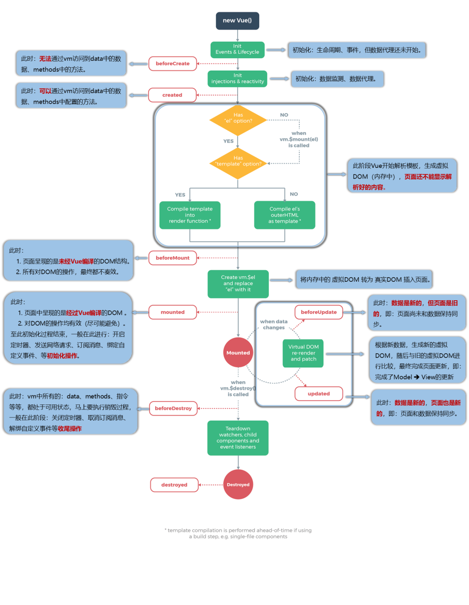

## Vue
## 第一章Vue核心
### vue的特点
- 采用组件化模式，提高代码复用率，便于维护
- 采用声明式编程，提高开发效率
- 采用虚拟DOM和diff算法，尽可能复用DOM节点
### 初识Vue
- 想让Vue工作，必须创建一个Vue实例，并传入一个配置对象
- root容器内的代码仍然符合html规范，只不过混入了一些Vue规则
- root容器内的代码被称为【Vue模板】
- Vue实例要与容器一一对应
- 开发中只会有一个Vue实例，会配置着组建使用
- {{xxx}}里的xxx要写js表达式，并且{{}}会读取data里的所有属性
- 一旦data里的数据发送改变，页面中用到该数据的地方会自动更新
```html
    <!-- 准备好一个容器 -->
    <div id="root">
        <h1>Hello,{{name}}</h1>
    </div>
    <script>
        //创建Vue实例 “V”要大写
        new Vue({
            el: '#root',  //el配置对应的容器 通常为css选择器字符串
            data: {    //data用于储存数据，数据供el所对应的容器使用  暂时先写成一个对象
                name: '张三'
            }
        })
    </script>
```
### 模板语法
Vue模板语法包括两大类
1. <b>插值语法</b>
   功能:用于解析标签体内容
   写法:{{xxx}}，xxx是js表达式，可以直接读取到data 中的所有区域
2. <b>指令语法</b>
   功能:用于解析标签（(包括:标签属性、标签体内容、绑定事件...)
   举例:`<a v-bind:href="xxx">` 或简写为`<a :href="xxx">`，xxx同样要写js表达式，可以直接读取到data 中的所有属性
   备注:Vue 中有很多的指令，且形式都是v-xxx，此处只是拿v-bind举例
### 数据绑定
1. 单向数据绑定(v-bind:)数据只能从data流向页面
2. 双向数据绑定(v-model:)数据双向都可以流动
    备注：双向绑定一般运用在表单上(如: input select(下拉表单)等)
          v-model:value可以简写成v-model,因为v-model默认收集的就是value的值
```html
单向数据绑定: <input type="text" :value="name">
双向数据绑定: <input type="text" v-model="name">
```  
### MVVM模型
M：模型(Model) ：对应 data 中的数据
V：视图(View) ：对应 模板
VM：视图模型(ViewModel) ：对应 Vue 实例对象
<b>观察发现：</b>
1.data中的所有属性最后都出现在了vm身上
2.vm身上的大部分属性，以及原型vue上的大部分属性，都可以在vue模板中直接使用

### vue中的数据代理

通过vm对象来代理data里的数据，将数据储存在_data中，再通过具体的属性来代理_data中的数据。vue中的数据代理是通过Object.defineProperty()实现的
好处：更加方便操作data里的数据
具体方法：
1、通过Object.defineProperty()方法将数据绑定到vm上
2、为每一个添加到vm的属性指定一个getter和setter
3、在getter/setter内部去读写data对应的属性

### 事件处理methods
#### 事件的基本使用
1. 使用v-on :xxx(简写@xxx) 绑定事件，其中xxx是事件名;
2. 事件的回调需要配置在methods对象中，最终会在vm上;
3. methods中配置的函数,不要用箭头函数!否则this就不是vm了;
4. methods中配置的函数，都是被Vue所管理的函数，this的指向是或组件实例对象;
5. @click="demo”和@click="demo($event)”效果一致，但后者可以传参;(这里的函数默认都会传一个event参数)
```html
<div id="root">
    <h1>欢迎{{name}}</h1>
    <button v-on:click="showInfo1">点我产生提示信息1</button>
    <button @click="showInfo2($event,66)">点我产生提示信息2</button>
</div>
<script>
    const vm = new Vue({
        el: "#root",
        data: {
            name: "zhangsan"
        },
        methods: {
            showInfo1() {
                alert("你好")
            },
            showInfo2(event, number) {
                alert(number)
                console.log(event.target.innerText);
            }
        }
    })
</script>
```
#### 事件修饰符
Vue中的事件修饰符:
1. prevent:阻止默认事件（常用）
2. stop:阻止事件冒泡（常用）:
3. once:事件县触发一次（常用）:
4. capture:使用事件的捕获模式;  (事件是先捕获后执行)
5. self:只有event.target是当前操作的元素时才触发事件:
6. passive:事件的默认行为立即执行，无需等待事件回调执行完毕
```html
<div class="box1" @click="showInfo">
    <button @click.stop="showInfo">点击我提示信息</button>
    <!-- 阻止冒泡 -->
</div>
<script>
    new Vue({
        el: "#root",
        data: {},
        methods: {
            showInfo() {
                alert("Hello")
            }
        }
    })
</script>
```
可以连用
`@click.prevent.stop="showInfo"`
#### 键盘事件
```html
<div id="root">
    <input type="text" @keyup.enter="showInfo">
    </div>
    <script>
        new Vue({
            el: "#root",
            data: {},
            methods: {
                showInfo(e) {
                    console.log(e.target.value);
                }
            }
        })
    </script>
```
1.Vue中常用的按键别名:
- 回车 => enter
- 删除=> deletle（捕获"删除”和“退格”键）
- 退出=>esc
- 空格=>space
- 换行=>tab(特殊,必须配合keydown去使用)
- 上=>up 下=>down 左=>left 右=>right

2.Vue未提供别名的按键，可以使用按键原始的key值去绑定，但注意要转为kebab-case（短横线命名）
3.系统修饰键（用法特殊）: ctr1、alt、shift、meta
(1).配合keyup使用:按下修饰键的同时，再按下其他键，随后释放其他键，事件才被触发。
(2).配合keydown使用:正常触发事件。
4.也可以使用keyCode去指定具体的按键（不推荐）
5.Vue.config .keyCodes.自定义键名=键码,可以去定制按键别名（不推荐
### 计算属性computed
```html
<div id="root">
        姓<input type="text" v-model="firstName">
        名<input type="text" v-model="lastName">
        全名<span>{{fullName}}</span>
    </div>
    <script>
        const vm = new Vue({
            el: "#root",
            data: {
                firstName: "张",
                lastName: "三"
            },
            computed: {
                fullName: {
                    get() {
                        //这里的this指向vm
                        return this.firstName + '-' + this.lastName
                    },
                    set(value) {
                        let name = value.split('-')
                        this.firstName = name[0]
                        this.lastName = name[1]
                    }
                }
            }
        })
    </script>
```
如果不需要set配置函数，可以简写为
```html
computed: {
    fullName(){
        return this.firstName + '-' + this.lastName
    }
}
```
1. 定义：要用的属性在data中不存在，要通过<b>已有的属性</b>计算得来
2. 原理：底层借助了Object.defineproperty方法提供的getter和setter
3.  get函数什么时候执行
   （1）初次读取时会执行
   （2）当依赖数据（this.firstName,this.lastName）发生改变时
4.  优势与methods相比，内部有缓存机制（复用），效率更高，调试方便
5.  备注:
    （1）计算属性最终会在vm上，直接读取使用即可  
    （2）如果计算属性需要被修改，那必须配置set函数去响应修改，并且需要依赖数据发生变化
### 监视属性watch
```js
watch: {
    isHot: {
        immediate: true,  //配置为true时，让handler初始化时调用
        deep:true  //深度监视
        //isHot发生改变时，handler调用
        handler(newValue, oldValue) {
        console.log("isHot被修改", newValue, oldValue)
        }
    },
    //当watch中只有handler时可以简写
    // isHot(newValue, oldValue) {
    //   console.log("isHot被修改", newValue, oldValue)
    // },
}
```
1. 当被监视的属性发生变化时,回调函数handler自动调用，进行相关操作
2. 监视的属性必须存在，才能进行监视
3. 常用的配置immediate、handler、deep（深度监视时使用）
4. 监视属性的两种写法：
    （1）new Vue时传入watch配置（如上）
    （2）通过vm.$watch监视（如下）
    ```js
    vm.$watch('weather', {
      handler(newValue, oldValue) {
        console.log("isHot被修改", newValue, oldValue)
      }
    })
    ```
5. 深度监视
Vue中watch默认不监视对象内部多层值的改变，配置deep可以监视多层（注意VUe自身是可以监视多层的）
```js
const vm = new Vue({
    el: "#root",
    data: {
    number: { //多层
        a: 1,
        b: 2
    }
    },
    watch: {
    number: {
        deep: true,
        handler() {
        console.log("number被修改了")
        }
    }
    }
})
```
### computed与watch的区别
1. computed能完成的功能,watch都可以完成。
2. watch能完成的功能，computed不一定能完成，例如: watch可以进行异步操作。两个重要的小原则:
    1. 所被Vue管理的函数，最好写成普通函数，这样this的指向才是vm或组件实例对象.
    2. 所有不被Vue所管理的函数（定时器的回调函数、ajax的回调函数promise的回调函数等），最好写成箭头函数这样this的指向才是vm或组件实例对象。
### 绑定样式
绑定样式:
1. class样式
写法: :class="xxx"xxx可以是字符串、对象、数组。
1. style样式(不常用)
: style="{fontSize: xxx}"其中xxx是动态值: style="[a,b]"其中a、b是样式对象。
```html
 <div id="root">
    <!-- 字符串写法 适用于：样式类名不确定，需要动态指定 -->
    <div class="basic" :class="mood" @click="changeMood">{{text}}</div> <br>
    <!-- 数组写法 适用于：样式个数不确定，类名也不确定 -->
    <div class="basic" :class="classArr">{{text}}</div> <br>
    <!-- 对象写法 适用于：样式个数确定，类名确定，要动态决定 -->
    <div class="basic" :class="classObj">{{text}}</div> <br>
  </div>
  <script>
    new Vue({
      el: "#root",
      data: {
        text: "测试",
        mood: "normal",
        classArr: ["a1", "a2", "a3"],
        classObj: {
          a1: true,
          a2: false
        }
      },
      methods: {
        changeMood() {
          let arr = ["normal", "happy", "sad"]
          this.mood = arr[Math.floor(Math.random() * 3)]
        }
      },
    })
  </script>
```
### 条件渲染
条件渲染:
1. v-if
写法:
(1).v-if="表达式"
(2).v-else-if="表达式"
(3).v-else="表达式"适用于:切换频率较低的场景。
特点:不展示的DOM元素直接被移除。
注意:v-if可以和:v-else-if、v-else一起使用，但要求结构不能被“打断”。
2. v-show
写法:v-show="表达式”
适用于:切换频率较高的场景。
特点:不展示的DOM元素未被移除,仅仅是使用样式隐藏掉
3. 备注:使用v-if的时，元素可能无法获取到，而使用v-show一定可以获取到。v-if常与template一起使用（template标签在渲染完成时会自己脱掉，常用于显示动态数据）
```html
<div v-show="n===1">哈哈</div>
    <template v-if="n===2">
      <h2>哈哈</h2>
      <h2>哈哈</h2>
      <h2>哈哈</h2>
    </template>
```
### 列表渲染
v-for指令:
1. 用于展示列表数据
2. 语法: v-for="(item，index) in xxx" :key="yyy"
3. 可遍历:数组、对象、字符串（用的很少）、指定次数（用的很少）
```html
<div id="root">
    <!-- 遍历数组 -->
    <ul>
      <li v-for="(p,index) in persons" :key="p.id">
        {{p.name}}-{{p.age}}
      </li>

    </ul>
    <!-- 遍历对象 -->
    <ul>
      <li v-for="(value,key) in car" :key="key">
        {{value}}-{{key}}
      </li>
    </ul>
  </div>
  <script>
    new Vue({
      el: "#root",
      data: {
        persons: [
          { id: 1, name: "张三", age: 18 },
          { id: 2, name: "李四", age: 19 },
          { id: 3, name: "王五", age: 17 }],
        car: {
          name: "奔驰",
          color: "black"
        }
      }
    })
  </script>
```
#### 列表遍历时key的作用及原理
在案例中我们用index作为key时可能会出现问题

react、vue中的key有什么作用?(key的内部原理)
<b>1. 虚拟DOM中key的作用:</b>
key是虚拟DOM对象的标识，数据发生变化时，Vue会根据【新数据】生成【新的虚拟DON】,随后Vue进行【新虚拟DOM】与【旧虚拟DOM】的差异比较，比较规则如下:
<b>2. diff对比规则:</b>
1.旧虚拟DOM中找到了与新虚拟DOM相同的key:
若虚拟DOM中内容没变,直接使用之前的真实DOM !
若虚拟DOM中内容变了，则生成新的真实DOM，随后替换掉页面中之前的真实DOM。
2.旧虚拟DOM中未找到与新虚拟DOM相同的key:
创建新的真实DOM，随后渲染到到页面。
<b>3. 用index作为key可能会引发的问题:</b>
1.若对数据进行:逆序添加、逆序删除等破坏顺序操作:
会产生没有必要的真实DOM更新==>界面效果没问题,但效率低。
2.如果结构中还包含输入类的DOM:
会产生错误DOM更新==>界面有问题。
<b>4. 开发中如何选择key? :</b>
1.最好使用每条数据的唯一标识作为key，比如id、手机号、身份证号、学号等唯一值。
2.如果不存在对数据的逆序添加、逆序删除等破坏顺序操作，仅用于渲染列表用于展示，使用index作为key是没有问题的。

### vue的数据检测
Vue监视数据的原理：
1. vue会监视data中所有层次的数据。
2. 如何监测<b>对象</b>中的数据？
通过setter实现监视，且要在new Vue时就传入要监测的数据`。
(1).对象中后追加的属性，Vue默认不做响应式处理
(2).如需给后添加的属性做响应式，请使用如下API：
    Vue.set(target，propertyName/index，value) 或
    vm.$set(target，propertyName/index，value)
1. 如何监测<b>数组</b>中的数据？
通过包裹数组更新元素的方法实现，本质就是做了两件事：
(1).调用原生对应的方法对数组进行更新。
(2).重新解析模板，进而更新页面。
4. 在Vue修改数组中的某个元素一定要用如下方法：
1.使用这些API:`push()、pop()、shift()、unshift()、splice()、sort()、reverse()`
2.Vue.set() 或 vm.\$set()
特别注意：Vue.set() 和 vm.\$set() 不能给vm 或 vm的根数据对象data添加属性！！！
注: 数据劫持可以理解成为vue对你写在data的数据会进行加工，让它们都变成响应式的
```html
  <div id="root">
    <h1>学生信息</h1>
    <button @click="student.age++">年龄+1岁</button> <br />
    <button @click="addSex">添加性别属性，默认值：男</button> <br />
    <button @click="student.sex = '未知' ">修改性别</button> <br />
    <button @click="addFriend">在列表首位添加一个朋友</button> <br />
    <button @click="updateFirstFriendName">修改第一个朋友的名字为：张三</button> <br />
    <button @click="addHobby">添加一个爱好</button> <br />
    <button @click="updateHobby">修改第一个爱好为：开车</button> <br />
    <button @click="removeSmoke">过滤掉爱好中的抽烟</button> <br />
    <h3>姓名：{{student.name}}</h3>
    <h3>年龄：{{student.age}}</h3>
    <h3 v-if="student.sex">性别：{{student.sex}}</h3>
    <h3>爱好：</h3>
    <ul>
      <li v-for="(h,index) in student.hobby" :key="index">
        {{h}}
      </li>
    </ul>
    <h3>朋友们：</h3>
    <ul>
      <li v-for="(f,index) in student.friends" :key="index">
        {{f.name}}--{{f.age}}
      </li>
    </ul>
  </div>
  <script>
    const vm = new Vue({
      el: "#root",
      data: {
        student: {
          name: 'tom',
          age: 18,
          hobby: ['抽烟', '喝酒', '烫头'],
          friends: [
            { name: 'jerry', age: 35 },
            { name: 'tony', age: 36 }
          ]
        }
      },
      methods: {
        addSex() {
          this.$set(this.student, "sex", "男")
        },
        addFriend() {
          this.student.friends.unshift({
            name: "jack",
            age: "12"
          })
        },
        updateFirstFriendName() {
          this.student.friends[0].name = "张三"
        },
        addHobby() {
          this.student.hobby.push("学习")
        },
        updateHobby() {
          this.student.hobby.splice(0, 1, "开车")
        },
        removeSmoke() {
          this.student.hobby = this.student.hobby.filter((h) => {
            return h !== "抽烟"
          })
        }
      }
    })
  </script>
```


### 收集表单数据 v-model的详细使用
若：`<input type="text"/>`，则v-model收集的是value值，用户输入的就是value值。
若：`<input type="radio"/>`，则v-model收集的是value值，且要给标签配置value值。
若：`<input type="checkbox"/>`
1.没有配置input的value属性，那么收集的就是checked（勾选 or 未勾选，是布尔值）
2.配置input的value属性:
    (1)v-model的初始值是非数组，那么收集的就是checked（勾选 or 未勾选，是布尔值）
    (2)v-model的初始值是数组，那么收集的的就是value组成的数组(注：这里的初始值就是在data中自己定义的类型比如：`hobby: []`)
备注：v-model的三个修饰符：
    lazy：失去焦点再收集数据
    number：输入字符串转为有效的数字
    trim：输入首尾空格过滤
```html
  <div id="root" @submit.prevent="demo">
    <form>
      账号: <input type="text" v-model.trim="userInfo.account"> <br>
      密码: <input type="password" v-model.trim="userInfo.password"> <br>
      年龄: <input type="number" v-model.number="userInfo.age"> <br>
      性别: 男: <input type="radio" name="sex" v-model="userInfo.sex" value="男"> 女: <input type="radio" name="sex"
        v-model="userInfo.sex" value="女"> <br>
      爱好: 学习<input type="checkbox" v-model="userInfo.hobby" value="study"> 打游戏<input type="checkbox"
        v-model="userInfo.hobby" value="game"> 吃饭<input type="checkbox" v-model="userInfo.hobby" value="eat"> <br>
      所属校区:
      <select v-model="userInfo.city">
        <option value="北京">北京</option>
        <option value="上海">上海</option>
        <option value="浙江">浙江</option>
        <option value="深圳">深圳</option>
      </select> <br>
      其他信息: <textarea v-model.lazy="userInfo.other"> </textarea> <br>
      <input type="checkbox" v-model="userInfo.ifAgree">阅读并接受<a href="http://www.bilibili.com">用户协议</a>
      <button>提交数据</button>
    </form>
  </div>
  <script>
    new Vue({
      el: "#root",
      data: {
        userInfo: {
          account: "",
          password: "",
          age: "",
          sex: "",
          hobby: [],
          city: "",
          other: "",
          ifAgree: ""
        }
      },
      methods: {
        demo() {
          console.log(JSON.stringify(this.userInfo))
        }
      },
    })

  </script>
```
### 过滤器
过滤器：
定义：对要显示的数据进行特定格式化后再显示（适用于一些简单逻辑的处理）。
- 语法：
1. 注册过滤器：Vue.filter(name,callback) 或 new Vue{filters:{}}
2. 使用过滤器：{{ xxx | 过滤器名}}  或  v-bind:属性 = "xxx | 过滤器名"
```html
<div>{{time | timeFormater("YYYY年MM月DD日")}}</div>
<div>{{time | timeFormater() | mySlice}}</div>
<script>
filters: {
        timeFormater(value, str = "YYYY-MM-DD HH:mm:ss") {
          return dayjs(value).format(str)
        },
        mySlice(value) {
          return value.slice(0, 4)
        }
      }
<script>
```
- 备注：
1. 过滤器也可以接收额外参数、多个过滤器也可以串联
2. 并没有改变原本的数据, 是产生新的对应的数据
### 内置指令
#### 之前学过的指令： 
`v-bind`	单向绑定解析表达式，可简写为:
`v-model`	双向数据绑定
`v-for`		遍历数组 / 对象 / 字符串
`v-on`		绑定事件监听，可简写为@
`v-show`	条件渲染 (动态控制节点是否展示)
`v-if`		条件渲染（动态控制节点是否存存在）
`v-else-if`	条件渲染（动态控制节点是否存存在）
`v-else`	条件渲染（动态控制节点是否存存在）
#### v-text指令
作用：向其所在的节点中渲染文本内容 
与插值语法的区别：v-text会替换掉节点中的内容，{{xxx}}则不会，更灵活
#### v-html指令
作用：向指定节点中渲染包含html结构的内容 
与插值语法的区别： 
1. v-html会替换掉节点中所有的内容，{{xxx}}则不会
2. v-html可以识别html结构
严重注意v-html有安全性问题！！！ 
在网站上动态渲染任意html是非常危险的，容易导致 XSS 攻击
一定要在可信的内容上使用v-html，永远不要用在用户提交的内容上！！！
#### v-cloak指令（没有值）
作用：使用css配合v-cloak可以解决网速慢时页面展示出{{xxx}}的问题
本质是一个特殊属性，Vue实例创建完毕并接管容器后，会删掉v-cloak属性
#### v-once指令（没有值）
作用：所在节点在初次动态渲染后，就视为静态内容了 
以后数据的改变不会引起v-once所在结构的更新，可以用于优化性能
#### v-pre指令（没有值）
作用：跳过v-pre所在节点的编译过程
可利用它跳过：没有使用指令语法、没有使用插值语法的节点，会加快编译
```html
<div id="root">
<h1>{{name}}</h1>
<h1 v-text="name"></h1>
<h1 v-html="str"></h1>
<h1 v-once>n的初始值为{{n}}</h1>
<h1>n的值为{{n}}</h1>
<button @click="n++">点我n+1</button>
<h1 v-pre>{{n}}</h1>
</div>
<script>
new Vue({
    el: "#root",
    data: {
    name: "张三",
    str: " <a href='http://www.bilibili.com'></a>",
    n: 1
    }
})
</script>
```
### 自定义指令directives
自定义指令总结：
一、定义语法：
(1).局部指令：
    new Vue({directives:{指令名:配置对象} })   或  new Vue({directives: {指令名:回调函数}})
```js
directives: {
    big(element, binding) {
        element.innerText = binding.value * 10
    },
    fbind: {
        // 指令与元素成功绑定
        bind(element, binding) {
        element.value = binding.value
        },
        // 指令被插入页面时
        inserted(element, binding) {
        element.focus()
        },
        // 指令所在模版被重新解析时
        update(element, binding) {
        element.value = binding.value
        }
    }
    }
```
(2).全局指令：
    Vue.directive(指令名,配置对象) 或  Vue.directive(指令名,回调函数)
二、配置对象中常用的3个回调：
(1).bind：指令与元素成功绑定时调用。
(2).inserted：指令所在元素被插入页面时调用。
(3).update：指令所在模板结构被重新解析时调用。
三、备注：
    1.指令定义时不加v-，但使用时要加v-；
    2.指令名如果是多个单词，要使用kebab-case命名方式，不要用camelCase命名。
### 生命周期函数
生命周期：
1. 又名：生命周期回调函数、生命周期函数、生命周期钩子。
2. 是什么：Vue在关键时刻帮我们调用的一些特殊名称的函数。
3. 生命周期函数的名字不可更改，但函数的具体内容是程序员根据需求编写的。
4. 生命周期函数中的this指向是vm 或 组件实例对象。

<b>常用的生命周期钩子：</b>
1.mounted: 发送ajax请求、启动定时器、绑定自定义事件、订阅消息等【初始化操作】。
2.beforeDestroy: 清除定时器、解绑自定义事件、取消订阅消息等【收尾工作】。
关于销毁Vue实例
1.销毁后借助Vue开发者工具看不到任何信息。
2.销毁后自定义事件会失效，但原生DOM事件依然有效。(click之类的原生事件依然会被调用)
3.一般不会在beforeDestroy操作数据，因为即便操作数据，也不会再触发更新流程了。
```html
 <div id="root">
    <h1 :style="{opacity: n}">你好</h1>
    <button @click="bye">点我销毁vm</button>
  </div>
  <script>
    const vm = new Vue({
      el: "#root",
      data: {
        n: 1
      },
      methods: {
        bye() {
          vm.$destroy()
        }
      },
      mounted() {
        this.timer = setInterval(() => {
          this.n -= 0.01
          if (this.n <= 0) this.n = 1
        }, 16)  //启动定时器
      },
      beforeDestroy() {
        clearInterval(this.timer)  //清除定时器
      }
    })
  </script>
```

## 第二章Vue组件化
### 模块与组件、模块化与组件化
<b>模块:</b>
a理解：向外提供特定功能的 js 程序，一般就是一个 js 文件
b为什么：js 文件很多很复杂
c作用：复用、简化 js 的编写，提高 js 运行效率
<b>模块化:</b>
当应用中的 js 都以模块来编写的，那这个应用就是一个模块化的应用

<b>组件:</b>
a定义：用来实现局部功能的代码和资源的集合（html/css/js/image…）
b为什么：一个界面的功能很复杂
c作用：复用编码，简化项目编码，提高运行效率
<b>组件化:</b>
当应用中的功能都是多组件的方式来编写的，那这个应用就是一个组件化的应用


### 非单文件组件
Vue中使用组件的三大步骤：
  一、定义组件(创建组件)
  二、注册组件
  三、使用组件(写组件标签)
  
一、如何定义一个组件？
    使用Vue.extend(options)创建，其中options和new Vue(options)时传入的那个options几乎一样，但也有点区别；
    区别如下：
        1.el不要写，为什么？ ——— 最终所有的组件都要经过一个vm的管理，由vm中的el决定服务哪个容器。
        2.data必须写成函数，为什么？ ———— 避免组件被复用时，数据存在引用关系。
    备注：使用template可以配置组件结构。
```js
// 创建组件
const school = Vue.extend({
  //用 template时里面的结构需要包裹到一个盒子中
  template: ` 
    <div>
    <h1>{{schoolName}}</h1>
    <h1>{{address}}</h1>
    <button @click="showSchoolName">点我显示学校名称</button>
    </div>`,
  data() {
    return {
      schoolName: "qzu",
      address: "浙江衢州",
    }
  },
  methods: {
    showSchoolName() {
      alert(this.schoolName)
    }
  },
})
```
二、如何注册组件？
      1.局部注册：靠new Vue的时候传入components选项
      2.全局注册：靠Vue.component('组件名',组件)，注册全局组件时，全局组件最好写在局部组件的前面
```js
//注册全局组件
Vue.component('hello', hello)
//注册局部组件
new Vue({
  el: "#root",
  data: {
    text: "你好啊"
  },
  components: {
    school: school,
    student: student
  }
})
```
三、编写组件标签：
```js
<div id="root">
  <school></school>
  <!-- 这里的hello是全局组件 -->
  <hello></hello>
</div>
```
几个注意点：
1. 关于组件名:
      一个单词组成：
            第一种写法(首字母小写)：school
            第二种写法(首字母大写)：School
      多个单词组成：
            第一种写法(kebab-case命名)：my-school
            第二种写法(CamelCase命名)：MySchool (需要Vue脚手架支持)
      备注：
          (1).组件名尽可能回避HTML中已有的元素名称，例如：h2、H2都不行。
          (2).可以使用name配置项指定组件在开发者工具中呈现的名字。
2. 关于组件标签:
      第一种写法：`<school></school>` (常用)
      第二种写法：`<school/>`
      备注：不用使用脚手架时，<school/>会导致后续组件不能渲染。
3. 一个简写方式：
      const school = Vue.extend(options) 可简写为：const school = options
### 关于VueComponent
1. school组件本质是一个名为VueComponent的构造函数，且不是程序员定义的，是Vue.extend生成的。
2. 我们只需要写`<school/>`或`<school></school>`，Vue解析时会帮我们创建school组件的实例对象，
  即Vue帮我们执行的：new VueComponent(options)。
3. 特别注意：每次调用Vue.extend，返回的都是一个全新的VueComponent！！！！注意这一点很重要
4. 关于this指向：
  (1).组件配置中：
      data函数、methods中的函数、watch中的函数、computed中的函数 它们的this均是 _【VueComponent实例对象】_。
  (2).new Vue(options)配置中：
      data函数、methods中的函数、watch中的函数、computed中的函数 它们的this均是 _【Vue实例对象】_。
5. VueComponent的实例对象，以后简称vc（也可称之为：组件实例对象）。
  Vue的实例对象，以后简称vm。 
6. 组件是可复用的 Vue 实例，所以它们与 new Vue 接收相同的选项，例如 data、computed、watch、methods 以及生命周期钩子等。仅有的例外是像 el 这样根实例特有的选项。所以vm与vc属性配置并不是一模一样，尽管vc底层复用了很多vm的逻辑
### 一个重要的内置关系

1.一个重要的内置关系：`VueComponent.prototype.__proto__ === Vue.prototype`
2.为什么要有这个关系：让组件实例对象（vc）可以访问到 Vue原型上的属性、方法。让操作更加方便。
